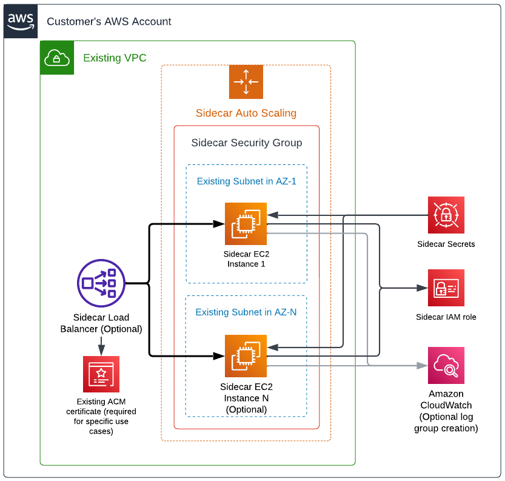

# Sidecar - CloudFormation AWS EC2

A quick start to deploy a sidecar to AWS EC2 using CloudFormation!

## Architecture



## Deployment

The elements shown in the architecture diagram above are deployed by the [Cyral sidecar CloudFormation module for AWS EC2](https://github.com/cyralinc/sidecar-cloudformation-ec2/). The module requires existing VPC and subnets in order to create the necessary components for the sidecar to run. In a high-level, these are the resources deployed:

* EC2
    * Auto scaling group (responsible for managing EC2 instances and EBS volumes)
    * Network load balancer
    * Security group
* Secrets Manager
    * Sidecar credentials
    * Sidecar CA certificate
    * Sidecar self-signed certificate
* IAM
    * Sidecar role
* Cloudwatch
    * Log group (optionally created)

### Requirements

* Make sure you have access to your AWS environment with an account that has sufficient permissions to deploy the sidecar. The minimum permissions must allow for the creation of the elements listed previously. We recommend Administrator permissions (`AdministratorAccess` policy) as the module creates an IAM role.

### Examples

#### Quickstart

* Save the code below in a `.yaml` file (e.g. `sidecar.yaml`) in a new folder.
* Log in to AWS and open the [CloudFormation console](http://console.aws.amazon.com/cloudformation/home).
    * Create a new stack.
    * Upload the `.yaml` file created previously.
    * Click `Next`.
    * Enter a suitable `Stack name`, then fill the parameters `SidecarId`, `ControlPlane`, `ClientID` and 
    `ClientSecret` with the information from the `Cyral Templates` option
    in the `Deployment` tab of your sidecar details.
    * Fill the parameters `VPC` and `Subnets` with an existing VPC and
    subnet that can connect to the database you plan to protect with this
    sidecar.
    * Click `Next`, follow the remaining steps of the wizard acknowledging the capabilities requested and confirm the stack creation.

```yaml

```

The quickstart example above will create the simplest configuration possible on your AWS account
and deploy a single sidecar instance behind the load balancer. As this is just a quickstart
to help you understand basic concepts, it deploys a public sidecar instance with an
internet-facing load balancer.

Deploying a test sidecar in a public configuration is the easiest way to have all the components
in place and understand the basic concepts of our product as a public sidecar will easily
communicate with the SaaS control plane.

In case the databases you are protecting with the Cyral sidecar also live on AWS, make sure to
add the sidecar security group (see output parameter `SidecarSecurityGroupID`) to the list of
allowed inbound rules in the databases' security groups. If the databases do not live on AWS,
analyze what is the proper networking configuration to allow connectivity from the EC2
instances to the protected databases.

#### Production Starting Point

* Save the code below in a `.yaml` file (e.g. `sidecar.yaml`) in a new folder.
* Log in to AWS and open the [CloudFormation console](http://console.aws.amazon.com/cloudformation/home).
    * Create a new stack.
    * Upload the `.yaml` file created previously.
    * Click `Next`.
    * Enter a suitable `Stack name`, then fill the parameters `SidecarId`, `ControlPlane`, `ClientID` and 
    `ClientSecret` with the information from the `Cyral Templates` option
    in the `Deployment` tab of your sidecar details.
    * Fill the parameters `VPC` and `Subnets` with an existing VPC and
    subnet that can connect to the database you plan to protect with this
    sidecar.
    * Click `Next`, follow the remaining steps of the wizard acknowledging the capabilities requested and confirm the stack creation.

```yaml

```

The example above will create a production-grade configuration and assumes you understand
the basic concepts of a Cyral sidecar.

For a production configuration, we recommend that you provide multiple subnets in different
availability zones and properly assess the dimensions and number of EC2 instances required
for your production workload.

In order to properly secure your sidecar, define appropriate inbound CIDRs using variables
`SSHInboundCIDR`, `DBInboundCIDR` and `MonitoringInboundCIDR`. See the
variables documentation in the [module's documentation page](https://github.com/cyralinc/sidecar-cloudformation-ec2)
for more information.

In case the databases you are protecting with the Cyral sidecar also live on AWS, make sure to
add the sidecar security group (see output parameter `SidecarSecurityGroupID`) to the list of
allowed inbound rules in the databases' security groups. If the databases do not live on AWS,
analyze what is the proper networking configuration to allow connectivity from the EC2
instances to the protected databases.

### Parameters

See the full list of parameters in the [module's documentation page](https://github.com/cyralinc/sidecar-cloudformation-ec2).